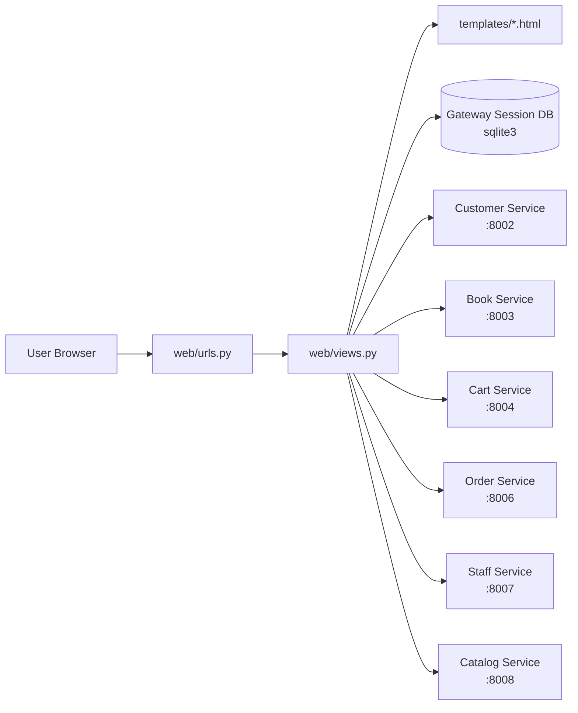
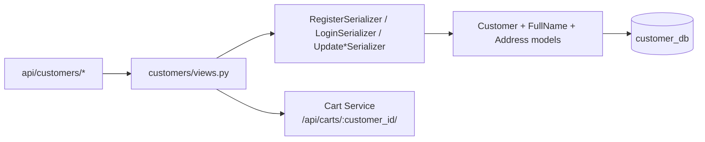
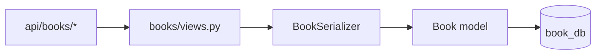
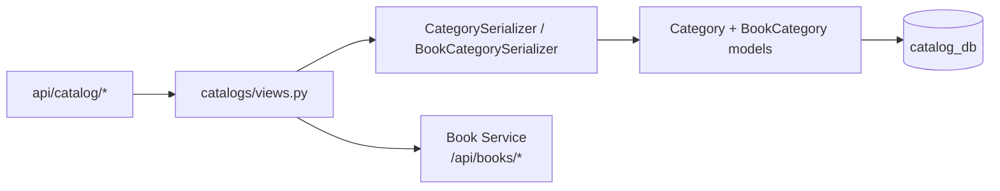
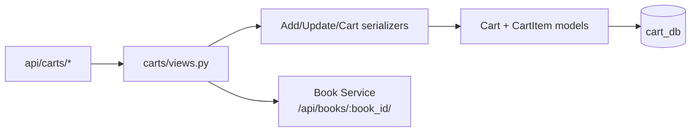
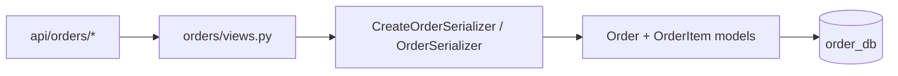
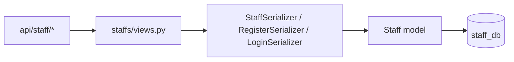
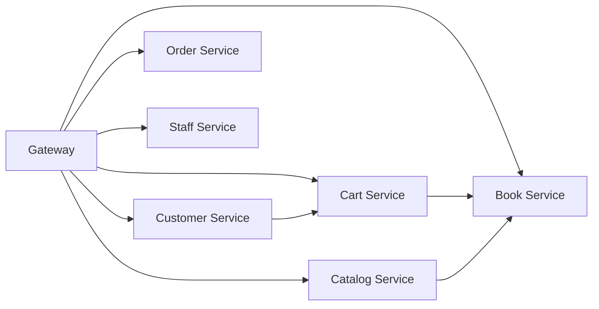

# Architecture Diagram for Each Service

Project: `c:\micro`  
Style: Django microservices + API Gateway + separate DB schema per service

## 1) Gateway Service (`gateway`, port `8005`)

Main responsibility:
- Render web UI and orchestrate calls to all backend services.

## 2) Customer Service (`customer-service`, port `8002`)

Main responsibility:
- Customer register/login/profile/address.
- On register, initialize cart by calling Cart Service.

## 3) Book Service (`book-service`, port `8003`)

Main responsibility:
- CRUD books and update stock (`stock_change`).

## 4) Catalog Service (`catalog-service`, port `8008`)

Main responsibility:
- Manage categories.
- Enrich/filter/sort book list with category data.
- Sync `category_id` to Book Service.

## 5) Cart Service (`cart-service`, port `8004`)

Main responsibility:
- Create/get cart by customer.
- Add/update/remove cart item.
- Validate `book_id` by calling Book Service.

## 6) Order Service (`order-service`, port `8006`)

Main responsibility:
- Create order from cart items and shipping address.
- List orders (per customer/all) and update order status.

## 7) Staff Service (`staff-service`, port `8007`)

Main responsibility:
- Staff register/login and staff listing/profile lookup.

## Inter-service Communication Summary

