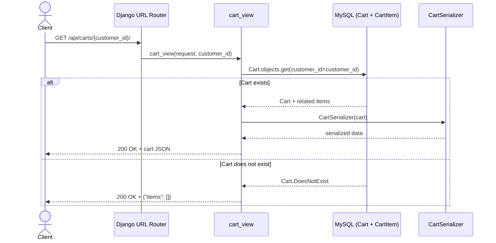
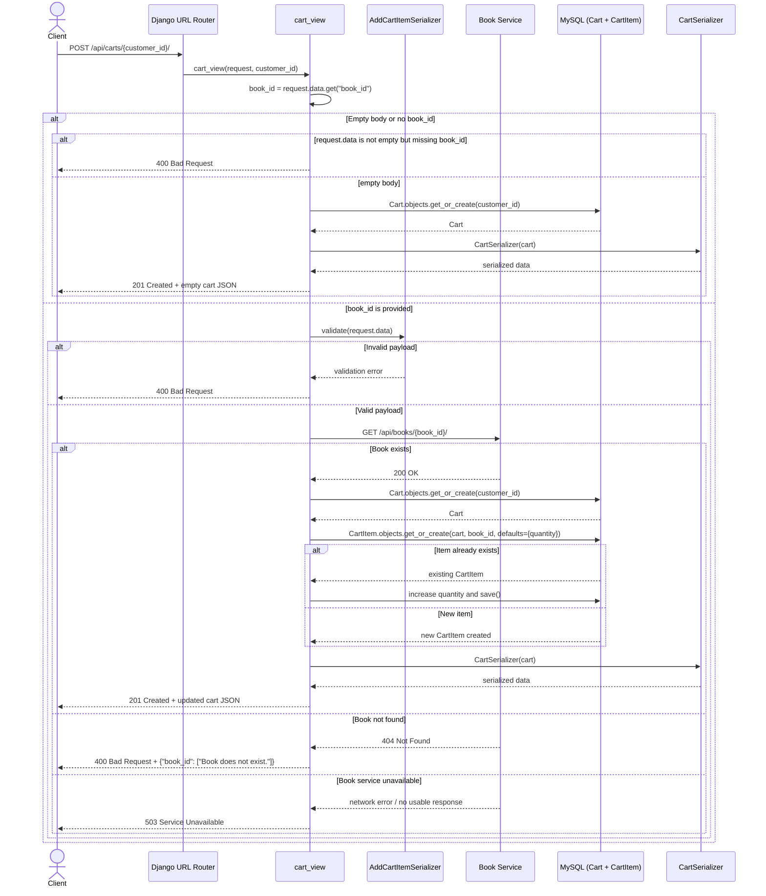
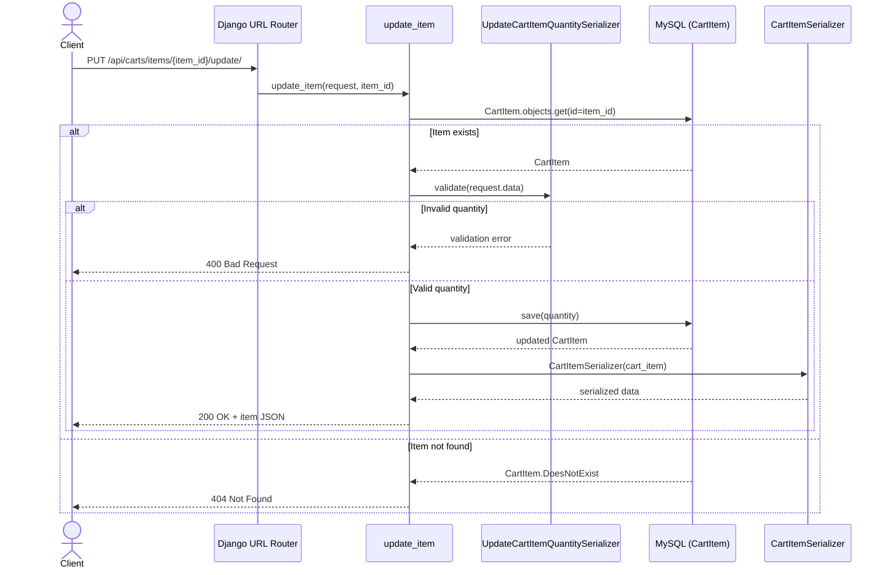
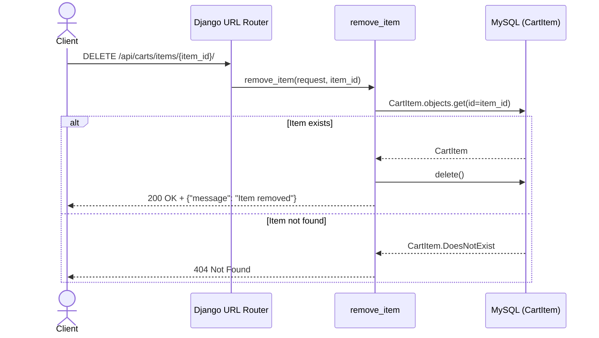

# Cart Service Sequence Diagram

## Overview

Base route: `/api/carts/`

Actors:
- Client
- Django URL Router
- Cart Views
- Serializer
- Cart DB
- Book Service

## 1. Get Cart By Customer

Endpoint: `GET /api/carts/{customer_id}/`

## 2. Initialize Empty Cart Or Add Item

Endpoint: `POST /api/carts/{customer_id}/`

## 3. Update Item Quantity

Endpoint: `PUT /api/carts/items/{item_id}/update/`

## 4. Remove Item

Endpoint: `DELETE /api/carts/items/{item_id}/`

## Code Mapping

- Route entry: `cart_service/urls.py` and `carts/urls.py`
- Business logic: `carts/views.py`
- Request validation and response serialization: `carts/serializers.py`
- Persistence model: `carts/models.py`
